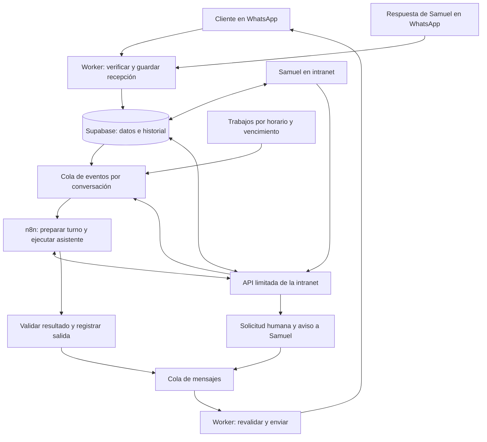

# Bot nuevo de El Rey — arquitectura y plan de construcción

Fecha: 25/09/2026. Cuenta nueva: `https://intranetelrey.app.n8n.cloud`.

**Estado: diseño de implementación; no es un bot construido ni publicado.** Samuel autorizó empezar de cero en n8n. Este documento sustituye la propuesta de continuar los flujos anteriores. Los requisitos de [CHATBOT_N8N.md](CHATBOT_N8N.md) se conservan. Se preservan la intranet, sus datos y PQRS; cada componente existente se reutiliza solo después de revisar su contrato y probarlo.

## 1. Resultado que buscamos

Un mismo asistente debe poder resolver información, explorar promociones, acompañar una compra, consultar al equipo y atender después de vender. El cliente puede cambiar de tema sin perder lo que ya dijo. Una consulta informativa puede terminar satisfactoriamente sin compra; si surge interés comercial, la conversación continúa con el mismo contexto.

La fidelidad se medirá en cinco aspectos: responder la pregunta actual, conservar datos y referencias, respetar las decisiones del cliente, sostener cada afirmación comercial con información vigente y ejecutar realmente lo que se anuncia.

Ejemplo de aceptación: después de ver tres productos, el cliente dice «el segundo, ¿y hasta qué hora abren?». El asistente identifica el segundo producto de **la lista que ese cliente recibió**, responde el horario y conserva la elección. No vuelve a listar todo ni exige dirección para responder el horario.

## 2. Evidencia revisada

| Recurso | Comprobado en esta sesión | Lo que todavía no demuestra |
|---|---|---|
| MCP nativo `mcp__n8n__*` | Acceso correcto; búsqueda devuelve 0 workflows | Integración con WhatsApp o intranet |
| Credenciales de la cuenta nueva | Listado accesible devuelve 0; el MCP informa cobertura de Gateway para modelos | Saldo, modelo elegido, acceso a Supabase o al Worker |
| Plataforma local | HEAD `26ad42b`; árbol limpio antes de estos documentos | Que la misma versión esté desplegada |
| Salud pública del Worker | Responde `ok:true` y presencia de las seis configuraciones consultadas | Validez de tokens, URL remota configurada, mantenimiento efectivo o entrega de mensajes |
| Intranet en código | Conversaciones, control manual, pendientes, conocimiento, inventario y QR | Funcionamiento de extremo a extremo con la cuenta nueva |

Hallazgos que afectan al diseño:

- `src/lib/api.js:listChatbotData` obtiene como máximo 2.000 mensajes y 500 adjuntos para todo el panel. Implementar carga paginada **por conversación**, con autorización por sede, para conservar historial completo.
- `src/worker.js:processClaimedWebhook` llama a n8n antes de terminar de persistir adjuntos. Separar recepción durable de procesamiento conversacional y representar explícitamente los archivos pendientes.
- `deliverQueuedWhatsAppMessage` solo admite imágenes de `payment-qrs`. Hace falta envío autorizado de imágenes de producto, con vinculación a conversación y origen.
- `resolveHumanTask` guarda la respuesta antes de intentar despertar n8n. La continuación debe recuperarse de una cola durable aunque falle ese aviso HTTP.
- `wrangler.jsonc` conserva la URL de automatización de la cuenta antigua. No cambiarla hasta probar el nuevo destino. El secreto `N8N_WEBHOOK_URL` remoto aún no se ha inspeccionado.
- El catálogo ya distingue `seasonal`, precio normal, precio promocional, fechas de promoción y cantidades reservadas. El formulario actual no expone precio/fechas promocionales; hay que completar esa edición para operar campañas.
- El panel de pendientes puede mostrar como alternativa el adjunto más reciente de la conversación. Para aprobar un pago se debe mostrar el comprobante exacto de esa solicitud; nunca sustituirlo silenciosamente por otro.
- Los datos de `demoStore.js` son ejemplos de interfaz, no inventario real. No usarlos para informar a clientes ni como evidencia de promociones disponibles.

## 3. Responsabilidades y conexiones

| Parte | Responsabilidad |
|---|---|
| WhatsApp / Meta | Transporte, adjuntos y estados de entrega |
| Worker | Firma de entrada, autenticación, recepción durable, API de herramientas, despacho y recuperación de trabajos |
| Supabase | Única fuente de conversaciones, permisos, catálogo, QR, solicitudes, reservas, pagos y pedidos; transacciones y auditoría |
| n8n | Un agente conversacional con modelo, memoria de contexto y herramientas limitadas; ejecución visible y evaluable |
| Intranet | Ver y responder chats; tomar/devolver control; resolver solicitudes; administrar información, promociones, imágenes y pedidos |
| Samuel | Resolver incertidumbres operativas y confirmar pagos; corregir al asistente o atender directamente |

La IA no recibe acceso SQL libre, llaves de Supabase/Meta ni la facultad de decidir destinatarios arbitrarios. Consulta herramientas concretas. La plataforma aplica permisos y valida cada operación, incluso si la IA propone algo incorrecto.

## 4. Estructura nueva de n8n

Diseño inicial de tres flujos operativos y un laboratorio. No se crean flujos vacíos como evidencia de avance.

1. **EL REY · Atención conversacional.** Webhook interno autenticado → reclamar evento y contexto → aplicar condiciones de atención → agente con herramientas → validar salida → registrar respuesta y efectos. Una conversación por ejecución; no usar bucles que compartan contexto entre clientes.
2. **EL REY · Respuestas del equipo.** Recibir evento autenticado de respuesta humana → comprobar identidad, solicitud y versiones → interpretar respuesta libre si hace falta → persistir decisión → encolar continuación al flujo de atención. Una aprobación sensible requiere evidencia explícita y vinculada; la IA solo propone su interpretación.
3. **EL REY · Seguimientos.** Recibir un trabajo vencido ya reclamado → comprobar su vigencia → ejecutar apertura, recordatorio o continuación permitida. Un ejecutor del Worker consulta la cola; no abrir una ejecución vacía de n8n cada minuto ni mantener un proceso dormido por cada chat.
4. **EL REY · Laboratorio.** Los mismos contratos, contexto y lógica del agente, con datos sintéticos y un adaptador de herramientas de prueba. Sin credenciales ni destinatarios de producción. Su resultado no sustituye la prueba integrada posterior.

Los avisos a Samuel y las respuestas al cliente utilizan el mismo despachador durable, con destinatarios y audiencias separados. Las herramientas se exponen mediante la API del Worker; no hace falta un workflow distinto por cada intención o producto.

La elección del modelo queda pendiente de descubrir disponibilidad real y evaluar español conversacional, uso de herramientas, coste y latencia. La cobertura de Gateway encontrada no prueba saldo ni calidad. Registrar versión de modelo, instrucciones y herramientas en cada evaluación.

## 5. Contexto y comportamiento del asistente

Cada turno se construye desde la base: pregunta actual, mensajes recientes realmente enviados/recibidos —incluidos los del operador—, resumen anterior con referencias, datos confirmados, sede, opciones ofrecidas, carrito, solicitudes abiertas, pedido y horarios. Los hechos comerciales se refrescan con herramientas; un resumen nunca autoriza un pago ni reemplaza una cotización vigente.

El resumen es una ayuda para recuperar contexto. Debe conservar preguntas sin resolver, correcciones y referencias a mensajes. Se puede pedir historial anterior paginado cuando «ese», «el otro» o «lo de ayer» no tenga antecedente suficiente. Las notificaciones internas y las instrucciones del equipo permanecen fuera del historial público.

No habrá un estado único que obligue a hacer siempre la misma pregunta. Se mantienen dimensiones independientes:

- **Autorización:** pendiente, concedida o rechazada, con evidencia de aceptación.
- **Control:** automático o manual, responsable y versión del control.
- **Atención:** asuntos abiertos y quién debe responder en cada uno; puede haber una consulta humana y una pregunta informativa simultáneas.
- **Compra:** opciones ofrecidas, selección, cotización, aceptación, reserva, pago y pedido; consultar horarios no borra el carrito.
- **Archivos:** pendientes de descarga, disponibles o fallidos, con propósito y procedencia.

Reglas de conversación: contestar primero lo que se pregunta; aprovechar datos dados juntos o por partes; pedir solo lo que falte; tolerar abreviaciones y errores; proponer pocas opciones pertinentes; no forzar compra ni despedida; no repetir saludos por mensaje; reconocer incertidumbre y explicar el siguiente paso concreto. Solicitar autorización antes de atención comercial con IA; conservar el mensaje inicial y obtener nombre/sede según los acuerdos existentes.

No se usarán reglas de palabras clave para sustituir las respuestas. Las validaciones devolverán razones y datos faltantes; el asistente formulará una pregunta útil. Las respuestas fijas se reservan para avisos operativos, consentimiento y recuperación de fallos cuando corresponda.

## 6. Contrato de herramientas

**Estos nombres describen interfaces a implementar, no endpoints ya disponibles.** El Worker incorpora identidad, conversación, sede autorizada, evento, versión y clave de operación desde el contexto autenticado. El modelo solo propone argumentos de negocio. Cada respuesta incluye estado (`ok`, `not_found`, `needs_human`, `conflict` o `unavailable`), datos, referencias y momento de consulta. `unavailable` nunca equivale a catálogo vacío.

| Herramienta | Entrada útil para el modelo | Resultado / límite |
|---|---|---|
| `consultar_informacion` | Pregunta y categoría opcional | Datos activos por sede/globales, vigencia y referencias; detectar contradicciones |
| `buscar_productos` | Descripción, presupuesto, características, temporada | Opciones existentes con ID, precio efectivo, disponibilidad y evidencia; búsqueda flexible, sin inventar coincidencias |
| `consultar_producto` | ID de una opción conocida | Detalle vigente y medios autorizados; no convertir una foto en prueba de stock |
| `actualizar_seleccion` | IDs, cantidades o correcciones explícitas | Carrito versionado y qué confirmaciones se invalidaron; no crea pedido ni cobra |
| `preparar_cotizacion` | Modalidad y datos disponibles | Resumen calculado por servidor, faltantes concretos y versión; tarifa desconocida requiere consulta |
| `solicitar_equipo` | Tipo, pregunta, hechos conocidos y decisión requerida | Solicitud vinculada y aviso durable; reutiliza la equivalente abierta |
| `obtener_qr` | Sede confirmada | Referencia al QR activo; descarga/ruta gestionada por el servidor |
| `enviar_imagen_autorizada` | ID de QR/producto/imagen compartida | ID de mensaje en cola y estado; solo imágenes autorizadas para esa conversación y propósito |
| `consultar_pedido` | Pedido vinculado o referencia del cliente | Estado del pedido cuyo acceso verifica el servidor; no acceder a otro cliente por conocer el número |
| `confirmar_pedido` | ID de cotización aceptada | Pedido persistido o razones que impiden crearlo; valida reserva, importe y resolución humana correspondiente |
| `solicitar_atencion_humana` | Motivo | Pausa de automatización y solicitud de atención; disponible si el cliente pide una persona |

La IA comercial **no tiene** `aprobar_pago`, `modificar_precio`, `cambiar_stock`, `resolver_solicitud_como_Samuel`, `enviar_a_numero` ni herramientas para borrar datos. La aprobación humana entra por un canal autenticado separado.

Las herramientas de escritura tienen límites de tamaño/tipo/cantidad y comprobaciones por objeto. La misma operación repetida devuelve el resultado previo. `confirmar_pedido` usa una clave de la compra/cotización, no una clave nueva por cada ejecución. Los efectos ya confirmados permanecen registrados aunque falle la red después.

La salida final del agente separa texto público de referencias internas. El cierre del turno verifica evidencias y efectos: no anunciar número de pedido inexistente, imagen no encolada, consulta no registrada o pago sin resolución humana. Verificar referencias no garantiza por sí solo que toda frase sea fiel; la evaluación semántica y las conversaciones reales siguen siendo necesarias.

## 7. Promociones, stock y compra

**Decisión confirmada por Samuel en esta sesión: el stock de promociones se actualizará manualmente en la intranet.** La búsqueda consulta `products` y `branch_inventory`. `seasonal=true` identifica producto de temporada, pero no demuestra descuento. Un precio promocional requiere vigencia válida. El servidor calcula precio efectivo y disponibilidad como existencia menos reservas; no lo deduce la IA.

La pantalla de inventario debe permitir ajustes por sede y registrar quién confirmó la existencia y cuándo. Separar la fecha de confirmación de stock de la fecha genérica de edición: cambiar una descripción no vuelve reciente un conteo. Las ventas creadas por el bot consumen inventario de forma transaccional; las ventas externas y reposiciones deben reflejarse mediante ajuste manual. Mostrar claramente existencia total, unidades reservadas y cantidad ofrecible, y proteger las reservas al ajustar. Si un conteo físico contradice una reserva, abrir incidencia para el equipo en vez de sobrescribirla o prometer una unidad inexistente.

Consultar disponibilidad al ofrecer y revalidarla antes de reservar/cobrar. El stock sin confirmación o marcado como dudoso requiere consulta humana. La caducidad de una confirmación será configurable y se fijará durante la preparación operativa; no asumir que un conteo manual permanece vigente para siempre. Las ventas presenciales no registradas no pueden detectarse automáticamente: esta limitación exige disciplina de actualización y forma parte del piloto. No se necesita una integración con el sistema de caja para esta versión.

Priorizar opciones relevantes de temporada dentro del presupuesto del cliente. Si pide un producto fuera del catálogo, crear consulta humana; distinguir «no está registrado» de «no lo tenemos». Si no hay promociones vigentes, decirlo y atender su necesidad sin inventar descuentos. No transferir precios entre sedes.

Guardar las opciones efectivamente enviadas y su orden. «El más barato» se resuelve sobre el conjunto pertinente; «quiero uno» sobre la referencia clara. Ante dos posibles referentes, aclarar. Una opción ofrecida no se agrega al carrito sin selección del cliente.

Antes de solicitar pago: selección y cantidades confirmadas, modalidad, comprador/destinatario, dirección si aplica, tarifa, total, cotización vigente y disponibilidad revalidada. La plataforma calcula `total_a_pagar = subtotal_productos + domicilio`; `orders.total` conserva su significado de subtotal. La aceptación queda vinculada a la versión exacta del resumen.

Reservar stock de forma transaccional al preparar un cobro aceptado, con vencimiento visible y configurable; la duración se fijará con la operación, no se prometerá una reserva sin política. Liberar reservas abandonadas o canceladas. Si hay comprobante en revisión y vence una reserva, requiere revisión del equipo; nunca descartar un pago recibido ni crear una venta sin stock. Dos clientes compitiendo por la última unidad no pueden obtener dos reservas válidas.

Transferencia, Addi, Sistecrédito y pago en sede para recogida requieren las condiciones ya acordadas. No hay contraentrega. Para pago en sede no fabricar estado «pagado»: validar con el equipo la modalidad y registrar pendiente de pago. Para crédito, resolución humana de la solicitud. Una transferencia se aprueba manualmente contra cotización, sede, importe y comprobante exactos.

Cambios de sede, productos o cantidades invalidan las confirmaciones afectadas. Una corrección de dirección conserva la confirmación de stock, pero exige revalidar cobertura y tarifa. Después de registrar el pedido, todo cambio comercial se consulta al equipo y el seguimiento usa el estado real.

## 8. Samuel, intranet y archivos

Cada aviso incluye cliente, sede, resumen breve, pregunta precisa, solicitud identificable y archivo cuando corresponda. Se envía al destinatario configurado, nunca al número sugerido en texto del cliente. La respuesta libre por WhatsApp se vincula usando la función **Responder** sobre ese aviso; desde intranet se vincula por ID y sesión autenticada. Una respuesta sin vínculo suficiente se aclara con Samuel. Las respuestas de pago ambiguas no aprueban nada.

Validar rol y sede del operador en **cada** acción. Tomar control aumenta la versión del control, cancela salidas automáticas aún pendientes y suspende recordatorios. Si una entrega a Meta ya se inició, no se puede retirar: mostrar ese estado y serializar el despacho con la toma de control para reducir la carrera. No prometer cancelar un mensaje ya enviado.

Devolver control crea un evento durable y un resumen de lo que hizo el operador. Resolver un pendiente durante control manual guarda la decisión sin reactivar al bot. Una instrucción interna tampoco libera control por sí sola. El operador distingue «enviar al cliente», «dar instrucción» y «devolver control».

Recibir imágenes/comprobantes primero como registros de archivo pendientes; procesarlos al estar disponibles, o mostrar fallo recuperable. Conservar el texto que acompañó la imagen. Separar cuatro propósitos: comprobante, foto del cliente, foto de producto compartida por Samuel y QR de sede. La visión/OCR, si se incorpora, solo ayuda a interpretar; no confirma pago ni existencia.

Los medios privados se acceden con permisos y enlaces temporales. La IA recibe IDs acotados, no rutas libres. QR reemplazado: revalidar la versión al enviar para no usar uno retirado. La recepción de audio/PDF y su interpretación se probarán explícitamente antes de ofrecerlas; si un formato no se interpreta, conservarlo para el equipo y pedir una alternativa útil al cliente.

## 9. Eventos, concurrencia y recuperación

Entrada propuesta: `event_id`, `event_type`, `conversation_id`, `source_message_id`, `occurred_at`, `input_version`. Tipos: mensaje cliente, archivo disponible, respuesta equipo, control devuelto, cambio pedido, apertura y recordatorio. La procedencia y el rol se resuelven en servidor, no desde etiquetas del mensaje.

1. Verificar firma y persistir antes de acusar recibo a Meta. Deduplificar por mensaje/evento.
2. Guardar mensaje y registrar trabajo en una misma transacción. Descargar adjuntos con trabajos independientes y recuperables.
3. Reclamar un turno con lease por conversación. Agrupar mensajes consecutivos ya disponibles, sin hacer esperar innecesariamente a otros clientes.
4. Cargar contexto e incrementar versión de entrada con nuevos mensajes, cambios relevantes o intervención humana. Las herramientas validan la versión; no reutilizar resultados caducados.
5. Ejecutar herramientas acotadas y guardar sus efectos con claves estables. Cerrar el turno y registrar salida de forma transaccional. No enviar WhatsApp directamente desde el razonamiento del agente.
6. Antes de despachar, revalidar control, destinatario, consentimiento, vigencia, ventana permitida y versión. Si llegó una corrección del cliente, cancelar la respuesta obsoleta y preparar otro turno. Un pedido ya creado válidamente no se borra porque un mensaje posterior cambie el contexto.
7. Distinguir fallo antes de envío de resultado de envío incierto. En caso incierto, conservar trazabilidad y conciliar estados antes de reenviar; no prometer entrega exactamente una vez por HTTP.

La recuperación de inbox, colas salientes y continuaciones no depende de que la pestaña de Samuel esté abierta. Número limitado de reintentos y pasos del agente; al agotarse, caso visible para el equipo y respuesta operativa honesta si el canal permite enviarla. Registrar fallo incluso si tampoco se puede notificar por WhatsApp. Las alertas técnicas adicionales de n8n se configurarán por separado del canal de consultas operativas.

## 10. Horarios y seguimiento

Conservar `America/Bogota`, atención 09:00–20:00 y domicilios hasta las 19:00. Confirmar el calendario operativo real antes de ampliar a festivos o excepciones. Fuera de horario guardar la consulta, informar horario y pedir consentimiento si falta; retomar en la siguiente apertura, incluyendo mensajes de madrugada.

Un único recordatorio a los 30 minutos por espera vigente del cliente, con horario y elegibilidad revalidados al despachar. No se envía si se espera al equipo, hay control manual, rechazo, nueva respuesta o compra completada. No usar ese recordatorio como campaña comercial. Mantener la base de cierre tras 24 horas de inactividad después de entrega, protegiendo pendientes; no cambiar esa duración sin acuerdo.

Antes de activar avisos y seguimientos reales, revisar la ventana y las plantillas disponibles en Meta para **cada destinatario**, incluido Samuel. Tener mensajes entrantes del cliente no habilita por sí mismo el envío al dueño. Si una notificación no puede entregarse, queda pendiente visible en la intranet; el bot no afirma que Samuel ya fue avisado.

## 11. Pruebas y condiciones de salida

El catálogo inicial está en [casos de aceptación](../n8n/rebuild/acceptance-cases.json). Son especificaciones, **todavía no pruebas ejecutadas**. Las instrucciones iniciales están en [system-prompt.md](../n8n/rebuild/system-prompt.md); se cargarán solo cuando existan las herramientas descritas.

| Etapa | Resultado que debe demostrarse antes de avanzar |
|---|---|
| A · Canal y control | Mensaje visible en intranet, historial paginado, respuesta manual, pausa/reanudación y protección de salidas en curso |
| B · Contexto e información | Agente aislado con herramientas; pregunta actual, cambios de tema, autorización, nombre/sede y datos reales sin invenciones |
| C · Equipo y medios | Consulta/notificación/respuesta/continuación; dos clientes simultáneos; QR correcto y adjuntos exactos |
| D · Compra | Promociones vigentes, selección contextual, stock concurrente, cotización aceptada, aprobación humana y un solo pedido |
| E · Operación | Seguimiento, horario/madrugada, recordatorio único, fallos/reintentos y recuperación sin interferir con atención manual |
| F · Piloto | Recorrido integrado con contactos de prueba controlados y revisión de Samuel; activar gradualmente después |

Medir por versión: respuestas que resuelven la pregunta, afirmaciones sin respaldo, datos repetidos innecesariamente, cruces de conversación, solicitudes humanas redundantes, efectos anunciados sin ejecutar, entrega, latencia y coste por conversación. Registrar resultados sin copiar secretos ni publicar datos personales. Objetivo de salida: todos los casos críticos aprobados, cero cruces de clientes/pagos falsos/pedidos duplicados/control manual ignorado en la batería; la calidad de redacción se revisa con ejemplos variados y no solo una frase exacta.

Las pruebas tienen tres niveles distintos: contrato/transacciones aisladas, conversaciones con modelo real y herramientas controladas, e integración real de WhatsApp–intranet–Samuel. Una prueba con respuestas simuladas no demuestra fidelidad del modelo; una ejecución verde de n8n no demuestra entrega. No activar con incidencias críticas abiertas.

## 12. Orden de implementación y cambio de cuenta

1. Verificar esquema remoto de Supabase y permisos frente a las migraciones locales; comprobar autenticación de Worker/Meta y datos reales sin exponer claves. Configurar credenciales nuevas de alcance limitado.
2. Construir el canal durable y control manual completo de la etapa A; agregar los cambios necesarios sin restaurar los flujos antiguos.
3. Implementar API de contexto/herramientas, agente aislado y evaluaciones; completar promociones en la intranet e identificar la fiabilidad del inventario.
4. Integrar respuestas humanas y medios, después compra y trabajos diferidos. Cada etapa deja evidencia reproducible de sus efectos.
5. Probar el piloto; guardar exportaciones/versiones, registrar estado de colas y evitar doble procesamiento antes del cambio de ruta.
6. Cambiar las URLs/configuración hacia la cuenta nueva con una sola ruta activa. Las rutas y credenciales antiguas no se copian como destino por defecto. Si falla el piloto, volver al mantenimiento comprobado, nunca reactivar automáticamente la IA antigua. Verificar la entrega del aviso de mantenimiento también como parte del corte.

No se han modificado rutas, secretos, migraciones aplicadas, workflows publicados ni información de clientes en esta fase de diseño. Los commits y el push quedan para Samuel en GitHub Desktop.

## Referencias técnicas consultadas

- [n8n Tools Agent](https://docs.n8n.io/integrations/builtin/cluster-nodes/root-nodes/n8n-nodes-langchain.agent/tools-agent/): herramientas y modelo del agente. Las decisiones de permisos, transacciones y contexto de este documento pertenecen a El Rey.
- [n8n: intervención humana](https://docs.n8n.io/advanced-ai/examples/human-fallback/): patrón de consulta al equipo.
- MCP de la nueva instancia: guías `chatbot` y `scheduling`; la guía `human_in_the_loop` no contenía documentación detallada. Se consultaron listados de workflows y credenciales, sin ejecutar flujos.
